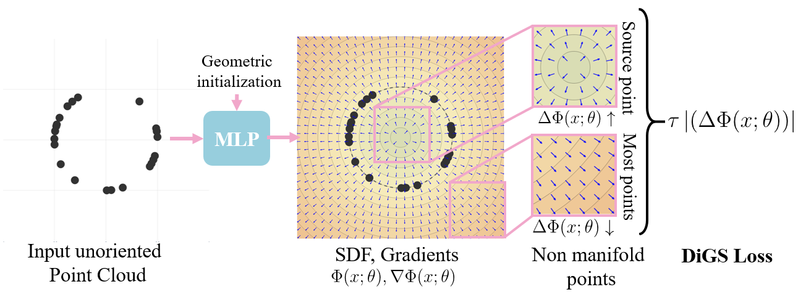

***DiGS***: Divergence guided shape implicit neural representation for unoriented point clouds (CVPR 2022)
---
Created by [Yizhak Ben-Shabat (Itzik)](http://www.itzikbs.com), [Chamin Hewa Koneputugodage]( https://www.linkedin.com/in/chamin-hewa-koneputugodage-b3ba17148/) and [Stephen Gould](http://users.cecs.anu.edu.au/~sgould/) from [ANU](https://www.anu.edu.au/), [Technion](https://www.technion.ac.il/) and [ACRV](https://roboticvision.org/).

__[Project page](https://chumbyte.github.io/DiGS-Site/)&nbsp;/ [Arxiv](https://arxiv.org/pdf/2106.10811)&nbsp;/ [Video](https://arxiv.org/pdf/2106.10811)__

<div align="center">
  <a href="https://www.itzikbs.com/" target="blank">
    
  </a>
  <a href="https://www.linkedin.com/in/chamin-hewa-koneputugodage-b3ba17148/" target="blank">
    
  </a>
  <a href="https://cecs.anu.edu.au/people/stephen-gould/" target="blank">
    
  </a>
</div>



## Introduction
This is the code for training shape implicit neural representations for unoriented 3D point clouds using our divergence constraint and multi-frequency geometric initialization.
It allows to train, test and evaluate the tasks of surface reconstruction and shape space learning.
We provide the code for training a new model and test that model on your own data.

Please follow the installation instructions below.

## Instructions

### 1. Requirements

Our codebase uses [PyTorch](https://pytorch.org/).

The code was tested with Python 3.7.9, torch 1.8.0, tensorboardX 2.1, CUDA 10.2.89 on Ubuntu 18.04 (should work with later versions).
For a full list of requirements see [the `requirement.txt` file](requirements.txt). Note we also use `plotly-orca` for visualisation, which needs to be installed from conda.

Example installation code (should install PyTorch separately):
```sh
conda create -n digs python=3.7.9
conda activate digs
conda install pip # for using pip commands in the conda env
pip install -r requirements.txt
conda install -c plotly plotly plotly-orca # conda only 
# Install with instructions from https://pytorch.org/get-started/locally/
# Below is instructions for installation of long term support (1.8.2 at the time).
conda install pytorch torchvision torchaudio cudatoolkit=11.1 -c pytorch-lts -c nvidia
# for CUDA 10.2: conda install pytorch torchvision torchaudio cudatoolkit=10.2 -c pytorch-lts
```

###  2. Testing on 2D Shapes (No External Data required)

We implemented a 2D shape dataset generator (`./sanitychecks/basic_shape_dataset2d.py`) that includes three shapes: Circle, L shape polygon, and Koch snowflake. The code generally allows any polygonal shape to be used and can be extended to other 2D shapes. 

To train a 2D shape neural representation and reconstruct the surface (curve in this case) for all three shapes run the script 
```sh
cd sanitychecks
./scripts/run_train_test_basic_shape.sh
```

For ease of use, we also provide separate scripts for training and testing: `./scripts/run_train_basic_shape.sh`, and `./scripts/run_test_basic_shape.sh` respectively.
By default, the output directory is `./sanitychecks/log/` where additional sub directories are created based on the training parameters (sampling type, shape) and unique identifier (default `my_experiment`). These options and others (including major hyperparameters) can be changed in the bash script.

To visualize the MFGI and geometric initializations run `./sanitychecks/scripts/visualize_initializations.sh`

### 3. Surface Reconstruction (and Scene Reconstruction)
#### 3.1 Data for Surface Reconstruction
##### 3.1.1 Surface Reconstruction Benchamark data
The Surface Reconstruction Benchmark (SRB) data is provided in the [Deep Geometric Prior repository](https://github.com/fwilliams/deep-geometric-prior).
This can be downloaded via terminal into the data directory by running `data/scripts/download_srb.sh` (1.12GB download). We use the entire dataset (of 5 complex shapes).

If you use this data in your research, make sure to cite the Deep Geometric Prior paper.

##### 3.1.2 ShapeNet data
We use a subset of the [ShapeNet](https://shapenet.org/) data as chosen by [Neural Splines](https://github.com/fwilliams/neural-splines). This data is first preprocessed to be watertight as per the pipeline in the [Occupancy Networks repository](https://github.com/autonomousvision/occupancy_networks), who provide both the pipleline and the entire preprocessed dataset (73.4GB). 

The Neural Spline split uses the first 20 shapes from the test set of 13 shape classes from ShapeNet. We provide [a subset of the ShapeNet preprocessed data](https://drive.google.com/file/d/1h6TFHnza0axOZz5AuRkfyLMx_sFcu_Yf/view?usp=sharing) (the subset that corresponds to the split of Neural Splines) and [the resulting point clouds for that subset](https://drive.google.com/file/d/14CW_a0gS3ARJsIonyqPc5eKT3iVcCWZ0/view?usp=sharing). These can be downloaded via terminal into the data directory by running `data/scripts/download_shapenet.sh`  (783.76MB download).

If you use this data in your research, make sure to cite the ShapeNet and Occupancy Network papers, and if you report on this split, compare and cite to the Neural Spline paper.

##### 3.1.3 Scene Reconstruction data
For scene reconstruction, we used the [scene from the SIREN paper](https://drive.google.com/drive/folders/1_iq__37-hw7FJOEUK1tX7mdp8SKB368K?usp=sharing). This can be downloaded via terminal into the data directory by running `data/scripts/download_scene.sh`  (56.2MBMB download).

If you use this data in your research, make sure to cite the SIREN paper.

#### 3.2 Running Surface Reconstruction
To train, test and evaluate on SRB run 

```./surface_reconstruction/scripts/run_surf_recon_exp.sh```

Similarly we provide a script for ShapeNet: 

```./surface_reconstruction/scripts/run_shapenet_recon.sh```

and for scene reconstruction 

```./surface_reconstruction/scripts/run_scene_recon_exp.sh``` 

These scripts have bash variables for changing the input, major hyperparameters, and where saves/logs/meshes are made.

#### 3.3 Visualization
We provide additional helper scripts for visualization : 
```
./surface_reconstruction/scripts/export_mesh_images.py # generates images of every mesh in the `result_meshes` directory. 
./surface_reconstruction/scripts/export_mesh_animation_images.py # generates a video of every mesh in the `result_meshes` directory with camera rotating around the mesh. 
./surface_reconstruction/scripts/plot_single_mesh.py # for visualizing a single mesh using open3d. (A good alternative to this is using [MeshLab](https://www.meshlab.net/))
./surface_reconstruction/scripts/plot_single_mesh_trajectory_animation.py # records a fly-through video of a given mesh (used for the scene reconstruction visualization) 
```

#### 3.4 Results
Our surface reconstruction results (meshes) on SRB are available for download [here](https://drive.google.com/drive/folders/1X6w8XLcrOCihxyCS82dkqW-EctvyIDlr?usp=sharing). 

You can check the results of this or other results on SRB by running
```
./scripts/compute_metrics_srb.sh
```
within the `surface_reconstruction` folder, where the variable `MESH_PATH` should be set to the folder containing the meshes (`gargoyle.ply` etc.).

### 4. Shape space learning:

For shape space learning we use the [DFAUST](https://dfaust.is.tue.mpg.de/) dataset, with the split from IGR. To download the dataset, you must make a (free) account on the site and then download. After that, use the [preproocessing and split pipleline of IGR](https://github.com/amosgropp/IGR).

Then run the `scripts/run_shapespace.sh` script within the `shapespace/` folder.


## Thanks

Thanks to the [SIREN codebase](https://github.com/vsitzmann/siren) and the [IGR](https://github.com/amosgropp/IGR)/[SAL](https://github.com/amosgropp/IGR) codebases off whom we built upon. 


This project has received funding from the European Union's Horizon 2020 research and innovation
programme under the Marie Sklodowska-Curie grant agreement No 893465.

## License and Citation

If you find our work useful in your research, please cite our paper:

[Preprint](http://arxiv.org/abs/2106.10811):
```bibtex
@inproceedings{ben2022digs,
  title={DiGS: Divergence guided shape implicit neural representation for unoriented point clouds},
  author={Ben-Shabat, Yizhak and Hewa Koneputugodage, Chamin and Gould, Stephen},
  booktitle={Proceedings of the IEEE/CVF Conference on Computer Vision and Pattern Recognition},
  pages={19323--19332},
  year={2022}
}
```

See [LICENSE](LICENSE) file.
